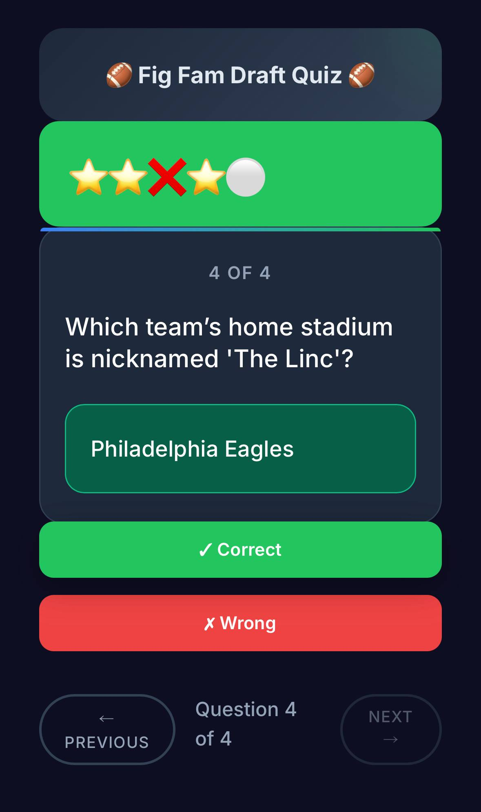

# 🏈 Fig Fam Draft Quiz 🏈

This site was vibe coded and spat out in an afternoon and strictly meant to be used for my family's fantasy football draft game.

Site: [ffquiz.figgy.foo](https://ffquiz.figgy.foo/)

- 5 questions per game, dealt as a ramp: 2 easy, then 2 medium, then 1 hard
- Chip system: start with 1 chip, earn one more for each correct answer, so 6 is a perfect round
- Legend: ⭐ for correct, ❌ for wrong, ⚪ for unanswered
- Each browser remembers the questions it has already asked and draws from what is left. Each difficulty rotates on its own, so the short hard list does not keep resetting the easy one
- **Play Again** on the results screen starts the next drafter. No page reload

The bank holds 241 questions: 80 easy, 87 medium and 74 hard. That is 40 rounds before an easy question repeats and 74 before a hard one does.

<div align="center">
  
</div>

## Keyboard shortcuts

| Key | Action |
| --- | --- |
| `1` | Mark correct |
| `2` | Mark wrong |
| `←` | Previous question |
| `→` | Next question, or finish the game |

## Adding questions

Add entries to `quiz-data.json`. Each one needs a question, an answer and a difficulty of `easy`, `medium` or `hard`:

```json
{
  "question": "Which team plays in Lambeau Field?",
  "answer": "Packers",
  "difficulty": "easy"
}
```

Two rules for a question that lasts:

1. **Make it stay true.** "Which team drafted Aaron Rodgers?" does not go stale. "What team does Aaron Rodgers play for?" goes stale every March.
2. **Make it have one answer.** "Which team has won the most Super Bowls?" has two, because the Patriots and the Steelers are tied.

Difficulty is a guess about the room, not about the sport. `easy` is what a child or a casual watcher answers straight away. `medium` is what a fan who watches every Sunday knows. `hard` is a record, a date or a play from before most of the room was watching.

## Tests

```sh
node test.js
```

This runs the game logic against a stub DOM and checks the scoring rules, the 2/2/1 round ramp and the per difficulty rotation. It needs no dependencies and no browser.
